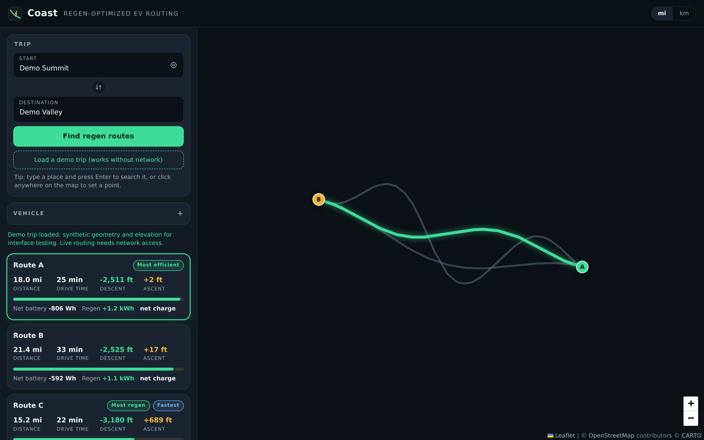

# Coast

Regen-optimized EV routing in the browser. Coast compares real driving routes by
how much energy the trip will actually cost after regenerative braking, and
highlights the alternative that recovers the most on descents.

**Live demo:** [aesteppe.github.io/coast](https://aesteppe.github.io/coast/)



## What it does

- Geocoded start and destination search with live suggestions, plus map-click point placement and browser geolocation
- Requests up to three road alternatives from OSRM for every trip
- Samples each route against a terrain elevation model (40 to 100 evenly spaced points per route)
- Runs a physics-based energy estimate per route and ranks alternatives by net battery use
- Grade-painted elevation profile: descents render green, climbs render amber
- Per-route comparison cards with distance, drive time, ascent, descent, downhill share, net battery draw, regen recovered, and efficiency
- Adjustable vehicle model: preset classes (compact, sedan, SUV, pickup), mass, and regen efficiency, with instant recomputation and no refetch
- Imperial and metric unit toggle
- Built-in offline demo trip: a synthetic mountain-pass descent with three contrasting alternatives, so the entire interface can be exercised without network access

## How the ranking works

For each sampled segment the model computes mechanical energy as rolling
resistance plus aerodynamic drag plus grade work:

```
E = (Crr * m * g + 0.5 * rho * CdA * v^2) * d + m * g * dh
```

Positive segments draw from the battery through a fixed drivetrain efficiency
(90 percent). Negative segments, where the descent is steep enough to overcome
resistance, return energy through regenerative braking at the configured regen
efficiency (50 to 80 percent, default 68 percent).

That asymmetry is the entire point. A climb costs the full grade work plus
losses, while the matching descent returns only a fraction of it. So routes are
ranked by estimated **net** battery use, which favors downhill-heavy paths
without pretending a detour that climbs to reach a descent could ever pay for
itself. The winner is the route that wastes the least.

The demo trip makes this visible: the alternative that recovers the most regen
is not the one that finishes ahead, because it climbs a ridge first.

Elevation samples pass through a short moving average before ascent and descent
are summed, since terrain-model noise would otherwise inflate both. All figures
are comparative estimates, not range predictions.

## Prior art

[ABRP](https://abetterrouteplanner.com) is the established EV trip planner and
already accounts for elevation, weather, and charging stops. Coast is not trying
to replace it. The difference is transparency and openness: the entire energy
model is about forty lines you can read, the whole stack is open data with no
API keys or account, and the interface is built to show *why* one route costs
less rather than just returning an answer.

## Stack

- Vanilla HTML, CSS, and JavaScript as native ES modules; no build step, no framework, no dependency install
- [Leaflet](https://leafletjs.com) 1.9 for the map, with CARTO dark basemap tiles
- [Chart.js](https://www.chartjs.org) 4 for the elevation profile
- [OSRM](https://project-osrm.org) public demo server for routing with alternatives
- [Nominatim](https://nominatim.org) for forward and reverse geocoding
- [Open-Elevation](https://open-elevation.com) for terrain, with automatic fallback to the [Open-Meteo](https://open-meteo.com) elevation API

## Running it

Browsers refuse to load ES modules from `file://`, so open it through any static
server:

```
python3 -m http.server 8000
```

Then visit `http://localhost:8000`. No build, no keys, no install.

Deployment is equally plain: the live demo is GitHub Pages serving the
repository root.

## Tests

```
node test/model.test.js
```

Covers geometry, resampling, smoothing, and the energy model with no browser and
no network.

## Project layout

```
index.html            markup only
css/styles.css        all styling
js/config.js          endpoints, constants, vehicle presets, palette
js/state.js           shared mutable state
js/utils.js           DOM, fetch, and geometry helpers
js/bus.js             tiny event emitter
js/format.js          unit-aware formatting
js/energy.js          the physics model and ranking
js/elevation.js       resampling, elevation APIs, smoothing
js/geocode.js         Nominatim and autocomplete
js/mapview.js         Leaflet
js/chartview.js       elevation profile
js/cards.js           route cards and status line
js/routing.js         the search pipeline
js/demo.js            offline demo trip
js/app.js             entry point and wiring
test/model.test.js    model assertions
```

All internal math is SI. Unit conversion happens only in `format.js`.

## Contributing

See [CONTRIBUTING.md](CONTRIBUTING.md). Issues labeled `good first issue` are
scoped small and have context in the description.

## Roadmap

- Temperature and headwind terms in the energy model
- Auxiliary load (climate, lights) as a constant draw
- Real EPA efficiency data behind the vehicle presets
- OpenRouteService support with a user-supplied key, so the app does not depend on the OSRM demo server
- Charging stop overlay from Open Charge Map
- Bridge and tunnel artifact detection in the elevation profile
- Position marker on the map synced to elevation chart hover

## API notes and limits

- The OSRM demo server and Nominatim are shared community infrastructure with fair-use policies. Coast keeps traffic light: one routing call per search, debounced geocoding at roughly one request per typing pause, and at most three elevation calls per search. Do not point production traffic at them.
- The public Open-Elevation instance can be slow or briefly unavailable; Coast falls back to Open-Meteo automatically, and a route still renders with distance and time if both fail.
- Terrain models measure ground elevation, not road deck, so bridges and tunnels can introduce artifacts in the profile.

## License

MIT.

## Disclaimer

Coast is a comparison tool. Energy figures depend on speed, temperature,
payload, and driving style, and should not be used for range-critical planning.
Drive safely and follow posted roads.
